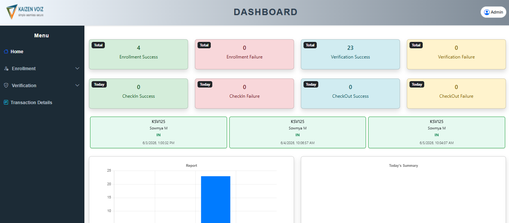
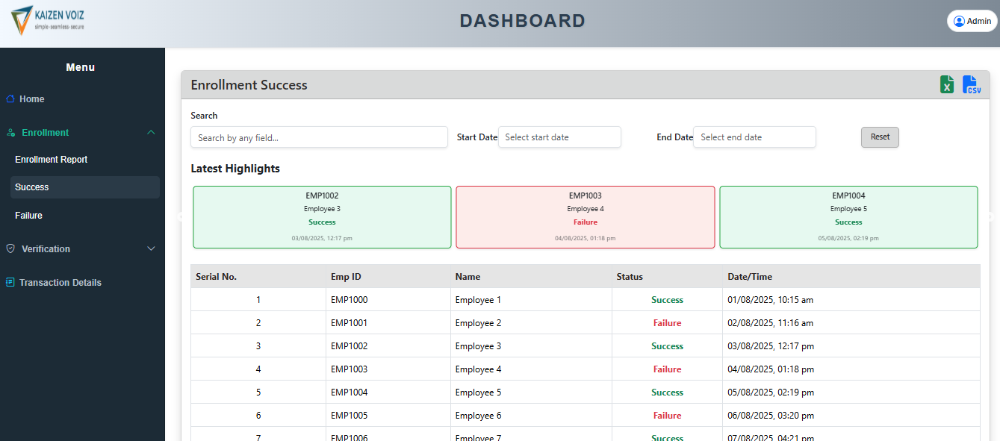
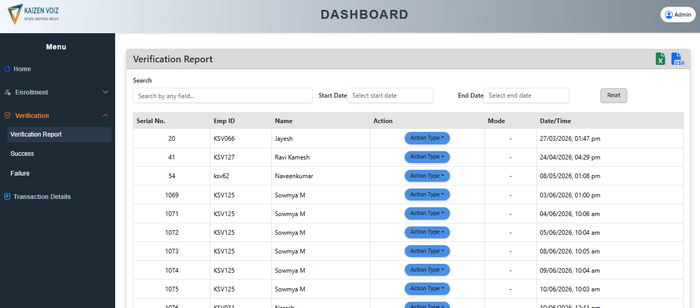
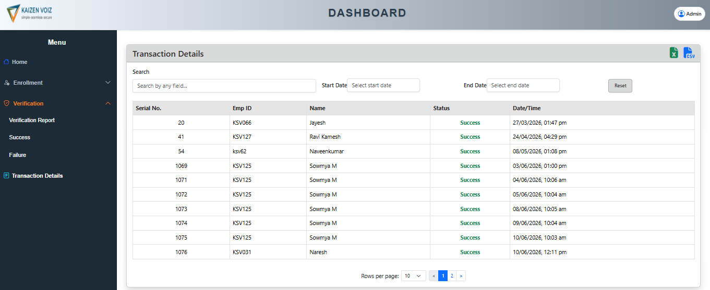

#  Admin Dashboard 

A responsive dashboard application built using React.js during my internship training. The project helps manage verification, enrollment, and transaction reports through an interactive dashboard interface.

---

## 🚀 Tech Stack

- React.js
- Bootstrap
- React Router DOM
- ExcelJS
- React Datepicker

---

## ⚙️ Getting Started

Clone the repository

```bash
git clone https://github.com/Subashreev18/react-admin-dashboard.git
```

Go to project directory

```bash
cd dashboard
```

Install dependencies

```bash
npm install
```

Run the project

```bash
npm start
```

---

## 📸 Screenshots

### Home Page


### Enrollment Page


### Verification Page


### Transaction Page


---

## 🌐 Live Demo

https://react-admin-dashboard-nsgp.vercel.app/
